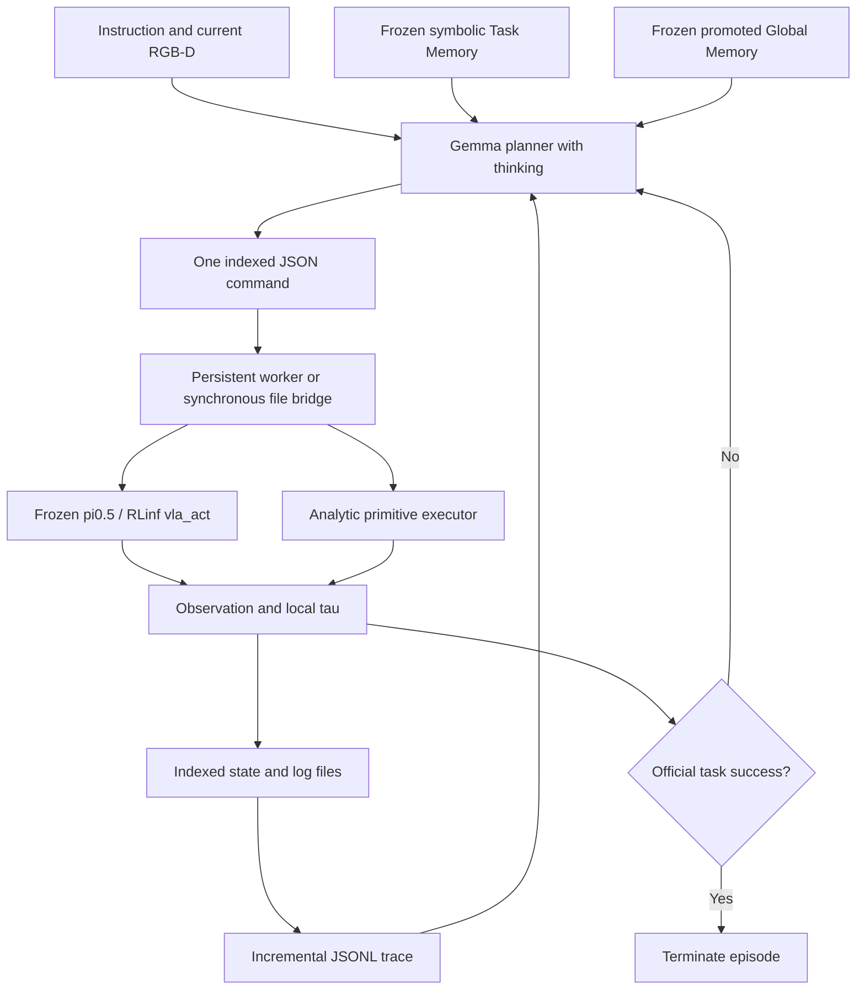

# Suggested title

Validate the paper-aligned Harness VLA lifecycle on LIBERO with frozen pi0.5 and memory-guided planning

## Summary

This work implements and validates a functional subset of the architecture from
**Harness VLA: Steering Frozen VLAs into Reliable Manipulation Primitives via
Memory-Guided Agents** (arXiv:2607.08448v2).

The resulting system combines a frozen pi0.5/RLinf policy, a Gemma planner with
thinking enabled, symbolic Task Memory, promoted Global Memory, visual RGB-D
grounding, a file-mediated execution protocol, and strict bootstrap/deployment
phase guards.

A complete physical lifecycle was validated in LIBERO:

- a successful bootstrap episode generated admissible symbolic Task Memory;
- a trace-backed Global Memory candidate was explicitly reviewed and promoted;
- a held-out deployment loaded both memories read-only;
- the held-out episode reached official environment success;
- all memory hashes remained unchanged during deployment.

This validates the minimum functional lifecycle. It does **not** claim a full
reproduction of the paper's experiments or benchmark results.

## Scientific scope

### Paper-confirmed mechanisms

- one primitive per planner turn;
- execute-observe-feedback-replan loop;
- `vla_act(prompt, max_chunks, tau)` for contact-rich behavior;
- analytic primitives for structured non-contact behavior;
- symbolic Task-Specific Memory;
- incremental Global Memory with explicit promotion;
- separate bootstrap and deployment phases;
- RGB-D/world-map perception role;
- file-mediated REPL protocol;
- official task predicate as the authoritative success signal.

### Paper-compatible implementation details

- strict JSON command schema;
- eager inference on NVIDIA V100 GPUs;
- concrete action budgets and chunk caps;
- native OSC transport representation;
- calibrated RGB-D projection;
- indexed command, state, and log files.

### Beta-only safeguards and instrumentation

- SHA-256 integrity checks and atomic writes;
- fail-closed parser, phase, and promotion guards;
- normalized Gemma visual coordinates;
- local visual tau thresholds;
- read-only privileged placement diagnostics, isolated from planning and action;
- reduced task/seed selection used for this functional validation.

## Implemented architecture

The fixed LIBERO-facing vocabulary now supports:

- `vla_act`
- `move_to`
- `move_pose`
- `rotate_wrist`
- `rotate_pitch`
- `set_gripper`
- `release`

The planner owns semantic selection. The worker owns geometry and physical
execution. Accepted actions, primitive postconditions, local tau, and official
task success are recorded as separate signals.

## Validated physical lifecycle

### Bootstrap

- Suite/task: `libero_spatial`, task 0
- Initial state: 0
- Bootstrap seed: 7
- Result: `task_success=true`
- Termination: `task_success`
- Planner turns: 1
- Physical actions: 79
- Invocation: `vla_act(max_chunks=20, tau=lift_and_grasp)`
- Privileged segmentation/contact in policy path: disabled
- Reportable benchmark episode: no, by phase policy

The local visual tau remained false, but the official environment predicate was
true. Official success correctly terminated the episode without rewriting the
local tau result.

Strict promotion accepted the Task Memory because the episode succeeded, the
trace was complete, every executed primitive postcondition was verified, and a
contact primitive was present. The persisted Task Memory contains symbolic
structure only, with no poses or coordinates.

### Global Memory promotion

The successful trace generated one pending `success_rule` candidate. It was
promoted only after explicit semantic review with the following limited
interpretation:

> Treat official task success as authoritative termination even when a local
> visual tau is not satisfied.

No broader causal or performance claim was inferred from the single episode.

### Held-out deployment

- Suite/task: `libero_spatial`, task 0
- Initial state: 1, different from bootstrap
- Held-out seed: 101
- Result: `task_success=true`
- Termination: `task_success`
- `harness_complete=true`
- Reportable benchmark episode: yes
- Planner turns: 1
- Physical actions: 85
- Invocation: `vla_act(max_chunks=20, tau=lift_and_grasp)`
- Task/Global Memory mode: read-only
- Privileged segmentation/contact in policy path: disabled

All four memory hashes were identical before and after deployment:

| Artifact | SHA-256 |
|---|---|
| Task Memory audit | `9cb5f2c8abe40c331cae20f3a7bd0494c9024cd2ed2077b90ed935b383610b85` |
| Task Memory commands | `3c3310d3f063dcc0a749604b9190be6cda47bdb889c367f26c0cccb676019f3a` |
| Global Memory ledger | `64dbc728153755694e17de1a2197e209fd7f5230126f6ef7e5f3f53e727f4baf` |
| Rendered Global Memory | `3e555b0ab4fbadbb2d36d14432f95c476f61eafdc77843b67e15ef3332403d45` |

The final integrity result was `unchanged=true`.

## Videos

### Final bootstrap: state 0, seed 7, success

<!--
Drag this local file into the GitHub card below this comment:
evaluation_runs/libero_functional_protocol_20260806_190132/bootstrap_task0_state0_seed7_commit_024d6b7/videos/task_000_state_000_success.mp4
-->

**Upload `task_000_state_000_success.mp4` here.**

### Held-out deployment: state 1, seed 101, success

<!--
Drag this local file into the GitHub card below this comment:
evaluation_runs/libero_functional_protocol_20260806_190132/deployment_task0_state1_seed101_commit_024d6b7_canonical/videos/task_000_state_001_success.mp4
-->

**Upload `task_000_state_001_success.mp4` here.**

### Historical multi-turn evaluation examples

These repository-hosted GIFs show the earlier Gemma-thinking evaluation stage,
including successful pick-and-place and remaining contact failures:

## Engineering fixes completed along the way

- disabled unsupported Triton compilation while preserving frozen weights;
- corrected LIBERO runtime and Python path handling;
- separated official success from local tau and primitive success;
- prevented stale `holding` state after failed contact;
- replaced privileged decision-time grounding with visual RGB-D grounding;
- made visual grasp monitoring robust to post-grasp occlusion;
- completed the seven-primitive LIBERO vocabulary;
- added a persistent file REPL worker with replay protection and shutdown;
- routed every primitive through the file protocol;
- replaced shared temporary filenames with unique atomic-write paths;
- added constrained-placement `vla_act(tau=task_success)` support;
- isolated privileged diagnostics from planner state and execution decisions;
- canonicalized memory provenance paths across working directories;
- added immutable deployment-memory verification.

## Validation

- Full test suite: **413 passed**
- Focused lifecycle tests: **7 passed**
- Editor diagnostics: no errors in changed files
- `git diff --check`: passed
- Successful physical bootstrap: verified
- Successful held-out deployment: verified
- Memory integrity after deployment: `unchanged=true`

Relevant final commits:

- `3e00507` - fix memory provenance across working directories
- `c95ba6c` - document functional Harness VLA lifecycle

## Limitations and non-claims

- This is a functional architecture validation, not a statistical benchmark
  reproduction.
- Bootstrap and deployment each completed through one VLA invocation. These two
  episodes therefore do not demonstrate physical composition between VLA and
  analytic primitives in the same successful lifecycle.
- The persistent worker was validated in a real subprocess, while the physical
  LIBERO rollout still used the synchronous file bridge.
- Placement remains physically variable across earlier runs.
- Exactly-once execution is not guaranteed if a process crashes after a physical
  action but before committing its state file.
- Memory on/off ablations and paired baseline comparisons have not been run on
  enough seeds.
- LIBERO-Pro, all LIBERO suites, RoboCasa365, and RoboTwin C2R were not
  reproduced.
- No statistically significant improvement over the frozen baseline is claimed.

## Follow-up work

- repeat held-out deployments on fixed seeds without changing mechanisms;
- run paired memory ablations: Task-only, Global-only, both, and neither;
- compare Harness and direct VLA execution with the same checkpoint, seeds, and
  budgets;
- exercise successful VLA plus analytic primitive composition in one lifecycle;
- expand from the current functional task to ten tasks and then all LIBERO
  suites;
- evaluate the remaining paper benchmarks only after the LIBERO protocol is
  reproducible at scale.

## References

- Canonical implementation and evaluation report:
  [`docs/HARNESS_VLA_FUNCTIONAL_ARCHITECTURE_REPORT.md`](https://github.com/marcospaulo429/harness-vla/blob/master/docs/HARNESS_VLA_FUNCTIONAL_ARCHITECTURE_REPORT.md)
- Implementation roadmap:
  [`docs/HARNESS_VLA_IMPLEMENTATION_ROADMAP.md`](https://github.com/marcospaulo429/harness-vla/blob/master/docs/HARNESS_VLA_IMPLEMENTATION_ROADMAP.md)
- Paper: [arXiv:2607.08448v2](https://arxiv.org/abs/2607.08448)