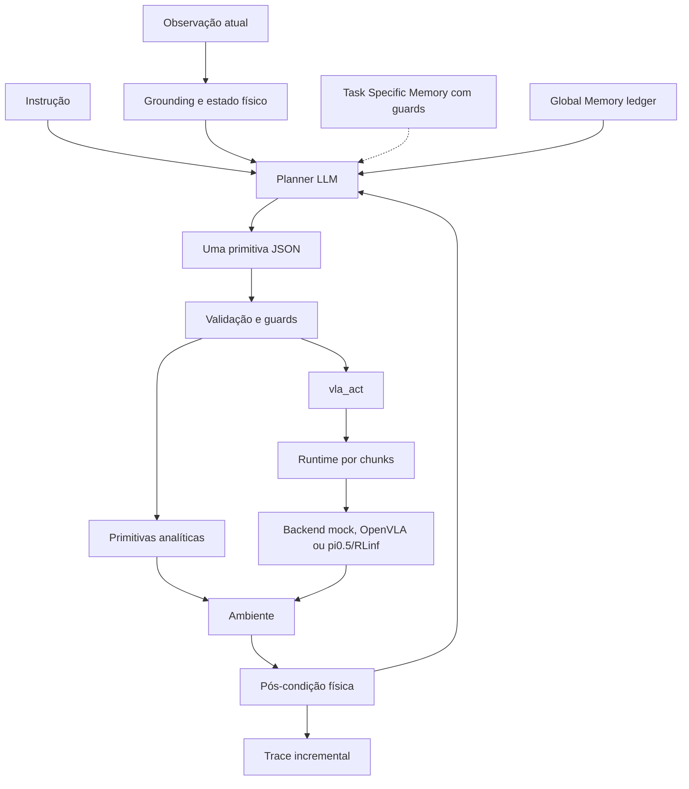

# Harness VLA beta: estado consolidado

Atualizado em 2026-08-06. Fonte científica: **Harness VLA: Steering Frozen
VLAs into Reliable Manipulation Primitives via Memory-Guided Agents**,
arXiv:2607.08448v2.

Este documento preserva o snapshot consolidado da beta anterior ao lifecycle
LIBERO funcional. O estado atual está em
`HARNESS_VLA_FUNCTIONAL_ARCHITECTURE_REPORT.md`; os relatórios em `docs/runs/`
são registros históricos imutáveis.

## 1. Veredito

A beta implementa o **núcleo arquitetural** do Harness VLA:

`planner -> primitiva JSON -> executor -> pós-condição -> nova observação -> feedback`

Ela ainda não implementa integralmente o **núcleo experimental** que sustenta a
contribuição do paper. Task Specific Memory, Global Memory incremental,
bootstrap/deployment e percepção isolada existem como componentes parciais,
mas ainda não formam um lifecycle completo em runs reais. O caminho nativo no
LIBERO já valida o VLA direto, uma invocação planner-facing, o compilador e o
executor fechado de pose analítica. Um smoke RGB-D isolado valida a geometria,
mas ainda usa segmentação privilegiada e não está integrado ao planner. As
memórias do Harness também não participam desse caminho.

Classificação correta do estado:

- **reprodução arquitetural:** parcial avançada;
- **reprodução funcional:** pendente;
- **reprodução experimental:** pendente.

Resultados de EB-Manipulation são probes locais. Eles não devem ser comparados
diretamente às taxas de sucesso publicadas para LIBERO-Pro, RoboCasa365 ou
RoboTwin C2R.

## 2. Classificação de fidelidade

- **paper-confirmed:** mecanismo e papel descritos pelo paper;
- **paper-compatible:** adaptação necessária cujo detalhe não é especificado;
- **beta-only:** instrumentação, benchmark ou heurística local, sem alegação de
  fazer parte do método publicado.

## 3. Arquitetura atual

### 3.1 Planner e primitivas

- O planner emite exatamente uma invocação por turno.
- A biblioteca é fixa durante deployment.
- Primitivas analíticas tratam estrutura sem contato.
- `vla_act` trata fases de contato e é retryable.
- Guards distinguem objeto manipulável, destino e objeto segurado.
- O parser recupera JSON de modelos que acrescentam reasoning ou pequenas
  variações de envelope.

### 3.2 Estado físico e auditoria

- `action_success`, pós-condição da primitiva e `task_success` permanecem
  métricas separadas.
- Grasp usa attachment quando disponível e geometria como evidência auxiliar.
- `move_to`, place e release possuem verificações físicas locais.
- Cada turno é persistido em JSONL incremental.
- Resultados podem ser reconstruídos mesmo após interrupção.
- Runs ficam em `evaluation_runs/<test_id>/`, com configuração e artefatos por
  experimento.

### 3.3 Percepção

- A infraestrutura RGB-D converte depth em coordenadas mundo calibradas.
- Cada estimativa guarda câmera, frame, pixel, profundidade e provenance.
- Um world map mantém identidade e idade das estimativas.
- A implementação atual ainda usa `sim_mask` para associação objeto-pixel e
  fornece coordenadas textuais ao planner. Isso é **beta-only** e não constitui
  percepção visual isolada completa.

### 3.4 Memórias

Task Specific Memory:

- geração offline de `audit.json` e `commands.jsonl`;
- promoção apenas de rollout com sucesso físico verificado;
- comandos parametrizados simbolicamente;
- carregamento por hash e re-grounding em coordenadas atuais;
- rejeição de objeto ausente ou binding ambíguo.
- integração fail-closed no runtime: memória inválida ou ambígua bloqueia o
  planner e `env.step`.

Ainda faltam retrieval automático, injeção no planner, execução guiada pela
estrutura recuperada e uma seed real promovida por bootstrap.

Global Memory:

- seed manual de success rules e failure models;
- ledger offline com provenance até trace/turn;
- deduplicação idempotente;
- bloqueio de escrita em deployment.
- validação de path, hash, turno, primitiva, outcome e evidência estruturada;
- pós-condição booleana isolada permanece `pending`, sem promoção causal.

Ainda faltam interpretação dos candidatos, promoção auditada e atualização
iterativa durante bootstrap.

### 3.5 VLA frozen

O contrato backend-neutral implementa:

- observação viva por chunk;
- prompt condicionado à tarefa;
- hard cap `max_chunks`;
- predicado de parada `tau`;
- early return e razão de término;
- auditoria por chunk.

Backends disponíveis:

- mock analítico para testes de interface;
- cliente OpenVLA HTTP para probes locais;
- cliente pi0.5/RLinf via OpenPI WebSocket.

O checkpoint `RLinf-Pi05-LIBERO-130-fullshot-SFT` foi validado na V100 em modo
eager. `torch.compile`/Triton não suporta corretamente `sm_70`; eager é uma
escolha de runtime **paper-compatible**, sem alterar os pesos frozen.

## 4. Evidências atuais

### 4.1 Testes leves

- 285 testes passavam neste snapshot após primitivas analíticas, smoke RGB-D e
  `lift_and_grasp`; a evolução posterior está no relatório funcional atual.
- Há testes para primitivas, planner, grounding, traces, pós-condições, Task
  Memory, Global Memory ledger, phase policy e backends VLA.

### 4.2 EB-Manipulation Etapa E

Configuração fixa: episódios `[0, 15, 38]`, Gemma 4 12B com thinking e executor
de contato analítico.

- `task_success = 1/3`;
- pick-and-place resolvido em três turnos;
- planejamento/formato deixaram de ser o bloqueio dominante;
- stack e wipe permaneceram bloqueados pela física scripted de contato.

Interpretação: valida o planner, o vocabulário e o loop de feedback. Não valida
um VLA frozen nem reproduz resultados científicos do paper.

Relatório: `docs/runs/HARNESS_GEMMA_THINK_ETAPA_E_20260731.md`.

### 4.3 pi0.5/RLinf nativo no LIBERO

Smoke baseline em LIBERO-Spatial, uma seed por tarefa:

- 10 episódios;
- 9 sucessos;
- uma falha por timeout na tarefa da tigela sobre o fogão.

Interpretação: checkpoint, normalização, observações e inferência estão
funcionais no embodiment nativo. Ainda não é o protocolo completo do paper e
não contém o Harness.

Runs ampliadas e preservadas:

- baseline repetida de 20 rollouts: `19/20` e `20/20`; a primeira reteve apenas
  `11/20` vídeos por colisão de nomes, e a segunda reteve `20/20` MP4s válidos;
- smoke VLA-only task 0/state 0: sucesso no chunk 16, 78 ações;
- smoke planner-facing com Gemma thinking no mesmo task/state: invocação
  `vla_act` válida, sucesso no chunk 16, 80 ações e zero parse errors.

Os dois smokes têm `harness_complete=false`: validam o backend, o runtime por
chunks, o predicado oficial e a auditoria, não o Harness completo. Relatório:
`docs/runs/HARNESS_LIBERO_VLA_SMOKES_20260806.md`.

O slice seguinte adicionou compilação OSC nativa e execução fechada de
`move_to`/pose com pós-condição física separada de `task_success`. Um smoke
RGB-D em task 0/state 0 grounded `2/2` instâncias com erro diagnóstico médio de
`0,0242 m` e máximo de `0,0393 m` entre a superfície observada e o centro do
corpo no simulador. A máscara de instância é **beta-only**, explicitamente
privilegiada, e as coordenadas oracle aparecem somente nas métricas. A run não
mede sucesso de tarefa e mantém `harness_complete=false`.

O runtime planner-facing também aceita agora o predicado local
`lift_and_grasp`, papel **paper-confirmed** em §2.3 e Apêndice B. A beta o mede
como contato bilateral dos finger pads e elevação RGB-D mínima de `0,03 m`;
essa fórmula e o limiar são **paper-compatible**, não especificados pelo paper.
Contato e máscaras vêm do simulador e são marcados como privilegiados. Satisfazer
esse predicado devolve controle ao planner, mas não implica `task_success`.

Duas runs reais com Gemma thinking e o pi0.5/RLinf frozen satisfizeram esse
predicado: `11` chunks/`53` ações com lift de `0,0367 m`, e `12` chunks/`56`
ações com lift de `0,0343 m`. Ambas tiveram contato bilateral, zero erros de
grounding, `task_success=false` e término por `tau_satisfied`, como esperado
para a fase local. A run canônica preserva MP4 de `57` frames em 224x224.

### 4.4 pi0.5/RLinf no EB-Manipulation

A integração cross-embodiment produziu o primeiro grasp real verificado da beta.
Uma correção passou a interpretar outputs OSC como comandos normalizados,
aplicando a escala posicional/rotacional do robosuite antes da conversão para
ações EB.

O transporte permaneceu instável porque checkpoint, robô, câmeras e espaço de
ação não correspondem ao treinamento. Esse caminho é diagnóstico
**paper-compatible/beta-only**, não reprodução do benchmark publicado.

## 5. O que ainda falta

Prioridade P0 para uma reprodução funcional:

1. usar Task Specific Memory em um lifecycle LIBERO real;
2. executar bootstrap e deployment com seeds oficiais no LIBERO;
3. promover Global Memory a partir de evidência durante bootstrap;
4. remover coordenadas e máscaras privilegiadas do payload do planner;
5. integrar o retorno de `lift_and_grasp` à fase analítica de transporte e
  ampliar os demais predicados;
6. integrar as primitivas analíticas e o RGB-D já isolados ao loop do planner;
7. completar o world map e o Harness LIBERO end-to-end.

Prioridade P1 para fidelidade arquitetural:

1. REPL mediado por arquivos entre planner e worker;
2. `move_pose` e pós-condições uniformes no embodiment LIBERO;
3. manifests que provem separação de seeds e congelamento das memórias;
4. protocolo completo de LIBERO e LIBERO-Pro com baselines pareadas e ablações.

Prioridade P2 para cobertura total:

1. RoboCasa365 com RLDX-1 e primitivas de base móvel;
2. RoboTwin C2R com LingBot-VLA e coordenação bimanual;
3. escala, seeds e estatísticas oficiais de todos os benchmarks.

Os critérios e a ordem executável estão em
`docs/HARNESS_VLA_IMPLEMENTATION_ROADMAP.md`.

## 6. Alegações permitidas

Já podemos afirmar:

- o núcleo planner/primitivas/feedback executa end-to-end;
- pós-condições evitam confundir movimento aceito com resultado físico;
- componentes offline de memória e re-grounding têm testes determinísticos;
- o pi0.5/RLinf frozen funciona no LIBERO nativo e pode ser chamado pelo
  runtime do Harness;
- a Etapa E valida a organização analítico/contato na beta.

Ainda não podemos afirmar:

- reprodução funcional do Harness VLA v2;
- ganho do Harness sobre o mesmo VLA frozen;
- robustez por Task/Global Memory em seeds perturbadas;
- percepção isolada sem informação privilegiada;
- resultados comparáveis a LIBERO-Pro, RoboCasa365 ou RoboTwin C2R.

## 7. Política de avaliação

Toda comparação deve manter checkpoint, planner, episódios, seeds, temperatura
e budgets constantes. Mudar apenas um fator por ablação. O predicado oficial do
benchmark é a métrica primária; `action_success` nunca substitui
`task_success`.

Ordem de evidência:

1. regressão da Etapa E;
2. baseline VLA nativa no LIBERO;
3. Harness LIBERO sem memória;
4. Task Memory e Global Memory isoladamente;
5. Harness completo;
6. LIBERO-Pro;
7. EB-Navigation como generalização **beta-only**;
8. RoboCasa365 e RoboTwin C2R.
