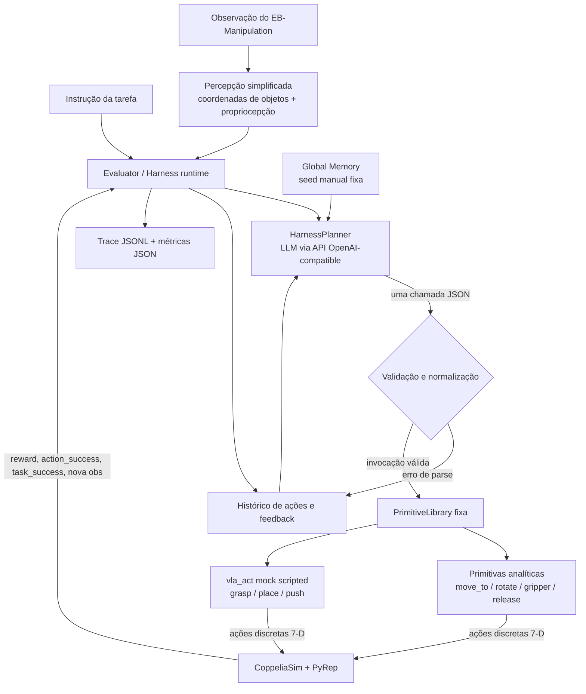

# Harness VLA sobre EmbodiedBench — arquitetura, implementação e resultados

> Relatório da beta implementada neste repositório, comparada ao paper **Harness VLA: Steering Frozen VLAs into Reliable Manipulation Primitives via Memory-Guided Agents**, arXiv:2607.08448v2 (14 de julho de 2026).
>
> Fonte do paper: <https://arxiv.org/abs/2607.08448v2> · <https://arxiv.org/pdf/2607.08448v2>

## 1. Resumo executivo

Foi construída uma **reprodução arquitetural simplificada** do Harness VLA sobre o ambiente **EB-Manipulation** do EmbodiedBench. A beta preserva o núcleo conceitual do paper:

1. um planner LLM é o único orquestrador cognitivo;
2. o planner emite **uma chamada JSON de primitiva por turno**;
3. a biblioteca de primitivas é pequena e fixa;
4. primitivas analíticas cuidam da estrutura sem contato;
5. uma primitiva especial `vla_act` representa operações com contato;
6. cada chamada é executada, o estado é observado novamente e o resultado realimenta o planner;
7. Global Memory fornece regras reutilizáveis de sucesso e modelos de falha;
8. traces auditáveis são persistidos por episódio.

A implementação **não é uma reprodução funcional completa nem uma reprodução dos experimentos do paper**. A principal diferença é que `vla_act` não contém um VLA real: é uma sequência scripted de ações analíticas. Também não foram implementados Task Specific Memory, bootstrapping exploratório, percepção RGB-D pelo planner ou o REPL mediado por arquivos.

A avaliação real executou 10 episódios no CoppeliaSim/PyRep. O pipeline concluiu sem crash, mas obteve **0/10 tarefas resolvidas**. Isso valida integração e observabilidade, não eficácia de manipulação. O modelo de teste `qwen2.5:0.5b-instruct` não conseguiu organizar as primitivas como o paper: 80,9% das primitivas executadas foram `vla_act`, enquanto o paper descreve invocações esparsas cercadas por controle analítico.

**Conclusão curta:** a arquitetura-base ficou parecida com o paper; a capacidade visuomotora, as memórias aprendidas, o protocolo experimental e o comportamento resultante ainda estão muito distantes da implementação completa.

---

## 2. Arquitetura implementada



### 2.1 Fluxo de um turno

1. O evaluator recebe a instrução da tarefa e observa o simulador.
2. A percepção converte objetos em uma tabela textual de coordenadas voxel e extrai a pose do end-effector.
3. O prompt combina instrução, estado atual, histórico recente, schemas das primitivas e Global Memory.
4. O LLM devolve exatamente uma invocação JSON.
5. O parser remove fences/prosa, recupera o primeiro objeto JSON balanceado e normaliza formatos alternativos.
6. A biblioteca valida a primitiva e compila a chamada para uma ou mais ações discretas 7-D.
7. O EB-Manipulation executa as ações no CoppeliaSim/PyRep.
8. O evaluator observa novamente, registra feedback e inicia o próximo turno.
9. O loop termina com o predicado de sucesso, fim do ambiente ou limite de 12 turns/30 env steps.

### 2.2 Interface de ação

O EB-Manipulation recebe:

`[X, Y, Z, Roll, Pitch, Yaw, Gripper]`

- `X/Y/Z`: voxels em `[0, 100]`;
- rotações: bins em `[0, 120]`, com resolução de 3 graus;
- gripper: `1 = aberto`, `0 = fechado`.

### 2.3 Biblioteca fixa de primitivas

| Primitiva | Tipo | Implementação da beta |
|---|---|---|
| `move_to` | analítica composta | move o end-effector para voxel ou objeto nomeado |
| `rotate_wrist` | analítica atômica | altera yaw preservando o restante da pose |
| `rotate_pitch` | analítica atômica | altera pitch preservando o restante da pose |
| `set_gripper` | analítica atômica | abre ou fecha o gripper em posição |
| `release` | analítica atômica | abre o gripper e pode fazer pequeno lift |
| `vla_act` | contato, mock | compila `grasp`, `place` ou `push` para sequências scripted |

O planner não pode inventar novas primitivas. A biblioteca mantém a mesma separação conceitual do paper, mas `vla_act` não executa uma política aprendida.

### 2.4 `vla_act` nesta beta

- `grasp`: staging acima do alvo → descida → fechamento → lift;
- `place`: staging acima do destino → descida → abertura;
- `push`: aproximação no alvo → deslocamento na direção solicitada.

Esse mock permite testar a fronteira planner/primitiva e o loop de feedback. Ele **não** possui visão, action chunks aprendidos, prompt condicionado em câmera, stop predicate aprendido ou capacidade de contato comparável a π0.5/RLDX-1/LingBot-VLA.

### 2.5 Memória

A Global Memory contém uma seed manual com:

- regras para usar `vla_act` somente nas fases de contato;
- staging e transporte por primitivas analíticas;
- retry após falha de contato;
- diagnóstico de empty grasp;
- prevenção de falso sucesso por proximidade visual.

Ela é injetada no system prompt, pode ser carregada/salva como JSON, mas não é atualizada automaticamente.

### 2.6 Parser e tolerância a modelos pequenos

A saída canônica é uma chamada JSON contendo uma primitiva. O normalizador também aceita:

- ação aninhada em `{"reasoning": ..., "action": {...}}`;
- ação canônica `{"action": "move_to", ...}`;
- nome da primitiva como chave, por exemplo `{"vla_act": {...}}`.

Isso foi necessário porque o modelo de 0.5B variava o formato mesmo com temperatura zero.

### 2.7 Auditoria

Por episódio são produzidos:

- `episode_N_res.json`: sucesso, reward, turns, env steps, erros e tempo;
- `trace_episode_N.jsonl`: saída crua, invocação, estado antes/depois, ações compiladas e feedback por turno;
- `summary.json`: agregado da avaliação.

Os artefatos ficam em `EmbodiedBench/running/` e são ignorados pelo Git por serem resultados locais.

---

## 3. Comparação direta com o paper

### 3.1 O que ficou fiel ao núcleo do paper

| Elemento do paper | Estado | Observação |
|---|---:|---|
| Planner como único orquestrador | Implementado | LLM escolhe a próxima primitiva; não emite torque/joint target diretamente |
| Uma primitiva JSON por turno | Implementado | contrato explícito e parser tolerante |
| Loop fechado observar → agir → observar | Implementado | nova percepção e feedback após cada primitiva |
| Biblioteca pequena e fixa | Implementado | cinco analíticas + `vla_act`; sem expansão em deployment |
| Separação contato vs. não contato | Implementado no design | prompt e schemas reservam `vla_act` para contato |
| `vla_act` retryable | Parcial | planner pode chamá-la novamente, mas diagnóstico de contato é grosseiro |
| Global Memory | Parcial | regras e failure models existem, porém são manuais e estáticos |
| Predicado oficial de sucesso | Implementado | `task_success` do EB-Manipulation é a verdade final |
| Budget e política de término | Implementado | 12 turns e 30 env steps na avaliação |
| Auditabilidade | Implementado | JSONL por turno e JSON de métricas |
| Re-grounding por turno | Parcial | coordenadas são atualizadas, mas vêm de percepção estruturada simplificada |

### 3.2 Similaridade real

A semelhança é **alta no esqueleto de software**:

`planner → JSON de primitiva → runtime → biblioteca fixa → simulador → nova observação → feedback → planner`

A semelhança é **baixa no componente de controle aprendido e no protocolo de memória**. No paper, o ganho vem justamente da combinação de:

- VLA frozen competente em contato;
- planner multimodal forte;
- Task Specific Memory construída em seed de referência;
- re-grounding visual em seeds perturbadas;
- Global Memory refinada a partir das execuções.

Nesta beta, três desses quatro elementos estão ausentes e o planner é um modelo tiny. Portanto, não seria correto comparar os 0% desta execução com as taxas reportadas no paper.

### 3.3 O comportamento observado ficou parecido?

**Não completamente.** O paper relata `vla_act` esparso, envolvido por staging, transporte, release e recuperação analítica. Na beta:

- 55 das 68 primitivas executadas foram `vla_act` (**80,9%**);
- somente 13 foram `move_to` (**19,1%**);
- nenhuma chamada executada de `rotate_wrist`, `rotate_pitch`, `set_gripper` ou `release` apareceu nos traces agregados;
- não surgiu de forma confiável o padrão `stage → vla_act → transport → release`;
- houve repetição de `vla_act` sem re-staging útil em vários episódios.

Assim, a **interface permite** o comportamento do paper, mas o modelo de 0.5B não aprendeu/seguiu a divisão de trabalho desejada.

---

## 4. O que foi implementado no repositório

### 4.1 Código principal

- `EmbodiedBench/embodiedbench/planner/harness/primitives.py`
  - biblioteca fixa;
  - compilação para ações 7-D;
  - normalização de invocações;
  - pose e resolução de alvos;
  - mock `vla_act`.
- `EmbodiedBench/embodiedbench/planner/harness/harness_planner.py`
  - cliente OpenAI-compatible;
  - uma decisão por turno;
  - parser robusto e contadores.
- `EmbodiedBench/embodiedbench/planner/harness/global_memory.py`
  - seed manual de regras/falhas;
  - load/save/render.
- `EmbodiedBench/embodiedbench/planner/harness/prompts.py`
  - papel do agente;
  - schemas;
  - contrato de saída;
  - estado, objetos, memória e histórico.
- `EmbodiedBench/embodiedbench/evaluator/eb_manipulation_harness_evaluator.py`
  - loop fechado;
  - execução no ambiente real;
  - selected indexes;
  - métricas e traces.
- `EmbodiedBench/embodiedbench/configs/eb-man-harness.yaml`
  - configuração Hydra do harness.
- `EmbodiedBench/run_harness_10ep.py`
  - runner explícito para dez episódios do eval set `base`.
- integração em `EmbodiedBench/embodiedbench/main.py` via `env=eb-man-harness`.

### 4.2 Testes

Foram criados testes unitários e de integração leve para:

- limites e convenções da ação 7-D;
- todas as primitivas;
- resolução/clamp de alvos;
- normalização dos formatos do modelo;
- parser JSON;
- Global Memory;
- loop planner → compile sem simulador.

Resultado: **38 testes passando** antes da avaliação pesada.

### 4.3 Commits principais

| Commit | Conteúdo |
|---|---|
| `d9b6109` | núcleo do Harness VLA, memória, planner e testes |
| `8544665` | evaluator, wiring e configuração |
| `4d21794` | escopo e itens adiados |
| `f11d899` | teste de integração closed-loop |
| `e9c1920` | normalização de formatos variados |
| `4d2779f` | habilitação do simulador, imports lazy, selected indexes e runner de 10 episódios |

### 4.4 Runtime instalado

Máquina validada:

- Ubuntu 22.04;
- 16 cores;
- 15 GB RAM, sem swap;
- NVIDIA RTX 3060;
- cerca de 16 GB livres no momento da instalação.

Stack instalado:

- Conda `embench_man`, Python 3.9;
- CoppeliaSim Pro 4.1.0;
- PyRep;
- amsolver;
- dataset EB-Manipulation `base`;
- Ollama 0.32.0;
- `qwen2.5:0.5b-instruct`;
- dependências Python mínimas, evitando Torch, Open3D, Ultralytics e vLLM no caminho language-only.

Patches de compatibilidade:

- import de `tools.grasploc`/Open3D tornado lazy;
- import de YOLO/Ultralytics tornado lazy;
- suporte a `selected_indexes` no evaluator;
- artefatos pesados adicionados ao `.gitignore`.

### 4.5 Validações realizadas

1. import do PyRep e amsolver;
2. launch/reset/close do EB-Manipulation no simulador;
3. obtenção de instrução e observação reais;
4. smoke test planner → Ollama → JSON → primitiva;
5. 38 testes automatizados;
6. avaliação completa dos 10 episódios selecionados;
7. geração de métricas e traces para todos os episódios.

---

## 5. Configuração da avaliação

| Campo | Valor |
|---|---|
| Ambiente | EB-Manipulation / `base` |
| Episódios | 10 selecionados de 48 |
| Famílias observadas | pick-and-place, shape sorter, stacking e wiping |
| Planner | `qwen2.5:0.5b-instruct` via Ollama |
| Modalidade do planner | language-only |
| Temperatura | 0.0 |
| Resolução do ambiente | 256 × 256 |
| Máximo de turns | 12 |
| Máximo de env steps | 30 |
| `approach_dz` | 8 voxels |
| `lift_dz` | 6 voxels |
| Task Specific Memory | desabilitada |
| Global Memory | seed manual fixa |
| `vla_act` | mock scripted |

Índices usados: `[0, 5, 10, 15, 19, 24, 29, 34, 38, 43]`.

---

## 6. Resultados dos 10 episódios

### 6.1 Resumo oficial

| Métrica | Resultado |
|---|---:|
| Tarefas | 10 |
| Tarefas concluídas | 0 |
| Success rate | **0,0%** |
| Planner steps médios | 11,6 |
| Episódios com ao menos um erro de formato | 8 |
| Turns totais | 116 |

O campo `output_format_error = 8` do `summary.json` conta **episódios** com pelo menos um erro. Nos traces existem 25 turns individuais com `parse_error`.

### 6.2 Por episódio

| Ep. | Instrução resumida | Sucesso | Turns | Erros JSON | Tempo reportado |
|---:|---|---:|---:|---:|---:|
| 1 | estrela → recipiente prateado | 0 | 12 | 3 | 399 s |
| 2 | prisma triangular → recipiente | 0 | 11 | 0 | 105 s |
| 3 | cubo → recipiente laranja | 0 | 9 | 0 | 37 s |
| 4 | empilhar cilindros | 0 | 12 | 9 | 0 s* |
| 5 | empilhar luas | 0 | 12 | 1 | 0 s* |
| 6 | estrela vermelha → shape sorter | 0 | 12 | 3 | 19 s |
| 7 | estrela lime → shape sorter | 0 | 12 | 1 | 447 s |
| 8 | estrela azul → shape sorter | 0 | 12 | 2 | 13 s |
| 9 | limpar área horizontal | 0 | 12 | 3 | 667 s |
| 10 | limpar área vertical | 0 | 12 | 3 | 454 s |

\* O tempo por episódio vem do último `info` do ambiente. Em episódios sem ação física válida, permaneceu no valor default; não representa wall-clock zero.

Tempo total aproximado observado da execução: **36 minutos**.

### 6.3 Status por turno

| Status | Quantidade | Percentual |
|---|---:|---:|
| `success` da primitiva | 63 | 54% |
| `parse_error` | 25 | 22% |
| `compile_error` | 23 | 20% |
| `failed` da primitiva | 5 | 4% |
| **Total** | **116** | **100%** |

Importante: `success` nessa tabela significa `action_success` da primitiva/subação, não sucesso final da tarefa.

- Parse JSON bem-sucedido: `91/116 = 78,4%`;
- compilação e execução iniciada: `68/116 = 58,6%` de todos os turns;
- após JSON válido: `68/91 = 74,7%` chegaram à execução.

### 6.4 Uso das primitivas

| Primitiva executada | Chamadas | Fração das executadas |
|---|---:|---:|
| `vla_act` | 55 | 80,9% |
| `move_to` | 13 | 19,1% |
| demais | 0 | 0% |

`vla_act` por episódio: `[8, 9, 9, 0, 0, 8, 5, 0, 8, 8]`.

### 6.5 Principais erros de compilação

| Causa | Ocorrências |
|---|---:|
| modelo usou a linha textual completa (`object 1: [x,y,z]`) como nome do target | 13 |
| target genérico `shape sorter` não existia na tabela de objetos | 6 |
| `move_to` sem `xyz` ou `target` | 3 |
| `vla_act` sem `target` ou `xyz` | 1 |

### 6.6 Diagnóstico

O resultado mostra três coisas diferentes:

1. **Integração aprovada:** planner, parser, primitivas, simulador, feedback e persistência funcionaram ponta a ponta.
2. **Planejamento insuficiente:** o modelo tiny teve 22% de parse errors, 20% de compile errors e repetiu `vla_act` sem compor uma solução completa.
3. **Controle de contato insuficiente:** o mock não substitui uma política VLA treinada; `action_success` local não resultou no predicado final das tarefas.

Não houve evidência de que a beta reproduza os ganhos científicos do paper. A avaliação foi um teste de sanidade de engenharia.

---

## 7. O que faltou implementar

### Prioridade 1 — necessária para chamar o sistema de Harness VLA funcional

1. **VLA frozen real em `vla_act`**
   - backend π0.5/OpenVLA/LingBot-VLA ou equivalente compatível com o ambiente;
   - câmera e linguagem como entrada;
   - action chunks aprendidos;
   - `max_chunks` e early-return predicate;
   - execução interrompida por condição de contato/progresso.

2. **Planner multimodal competente**
   - RGB, depth e propriocepção reais;
   - identificação semântica de objeto/destino;
   - grounding métrico por pixels + world map;
   - modelo maior capaz de seguir schemas e raciocinar espacialmente.

3. **Task Specific Memory**
   - fase de bootstrapping na seed de referência;
   - audit JSON semântico;
   - trace JSONL procedural;
   - substituição de coordenadas literais por queries simbólicas;
   - retrieval por tarefa;
   - re-grounding em novos layouts/seeds.

4. **Global Memory aprendida**
   - extração de regras e failure models dos traces;
   - atualização incremental durante exploração;
   - preservação de negative evidence;
   - substituição de estratégias por versões mais curtas/confiáveis.

### Prioridade 2 — fidelidade ao runtime do paper

5. **REPL síncrono mediado por arquivos**
   - `command.json`;
   - `state_NN.json`;
   - RGB-D/world maps;
   - `log_NN.json`;
   - `done_NN.flag`;
   - planner e worker em processos separados.

6. **Perception isolation**
   - impedir acesso a coordenadas estruturadas privilegiadas;
   - planner localiza somente a partir de RGB-D/world maps;
   - robustez a bordas, oclusão, reflexos e mudança de câmera;
   - re-localização obrigatória após cada movimento relevante.

7. **Bootstrapping e deployment como fases distintas**
   - `reset` permitido apenas na exploração;
   - budget generoso para descobrir solução;
   - reset desabilitado e budget curto na avaliação;
   - seeds de referência excluídas da métrica final.

8. **Diagnóstico de contato robusto**
   - teste quantitativo de deslocamento objeto/end-effector;
   - empty grasp real;
   - contato instável;
   - falso sucesso;
   - progresso parcial e continuação de VLA;
   - pós-condições específicas por primitiva.

### Prioridade 3 — cobertura do paper

9. **Primitivas ausentes/extensões**
   - `move_pose`;
   - `navigate_to` e `move_base` para base móvel;
   - argumento `arm` e coordenação bimanual;
   - tolerâncias, budgets e post-conditions por backend.

10. **Benchmarks e protocolos do paper**
    - LIBERO e LIBERO-Pro;
    - RoboCasa365;
    - RoboTwin C2R;
    - seeds de bootstrapping e held-out;
    - task/instruction redirection e position swap;
    - clean-to-randomized transfer.

11. **Baselines e ablações**
    - VLA frozen direto;
    - planner sem memória;
    - sem Task Specific Memory;
    - sem Global Memory;
    - limite de número de `vla_act`;
    - comparação entre planners;
    - atribuição de finalização por classe de primitiva.

12. **Escala experimental**
    - centenas de rollouts, não somente dez;
    - múltiplas seeds;
    - intervalos de confiança;
    - success rate por família/perturbação;
    - estatísticas de uso de primitivas comparáveis ao Apêndice F.

13. **Outros itens de produção**
    - retomada após crash;
    - timeouts por chamada;
    - validação JSON por schema/structured output;
    - versionamento de memória;
    - captura de uso de GPU/RAM/latência;
    - empacotamento reproduzível do CoppeliaSim/PyRep/dataset.

---

## 8. Próximos passos recomendados

### Etapa A — corrigir o planner atual sem aumentar muito o custo

1. Passar uma lista explícita de IDs válidos de objetos no prompt.
2. Exigir `target` pertencente a essa enumeração via JSON Schema/structured output.
3. Separar `object`, `destination` e `surface` na percepção.
4. Rejeitar semanticamente strings como `object 1: [29, 26, 19]` e extrair `object 1`.
5. Adicionar uma pequena máquina de estados de segurança para impedir repetição infinita de `vla_act`.
6. Exigir staging/transport/release após um grasp reportado como bem-sucedido.

### Etapa B — avaliar a arquitetura, ainda com mock

1. Usar um planner 1.5B/3B ou maior.
2. Rodar novamente os mesmos dez episódios.
3. Medir redução de parse/compile errors.
4. Verificar se aparece `move_to → vla_act → move_to → release`.
5. Comparar a distribuição de primitivas com a divisão de trabalho esperada.

### Etapa C — aproximar-se de verdade do paper

1. Integrar um VLA frozen compatível com um benchmark suportado.
2. Implementar percepção multimodal isolada.
3. Construir Task Specific Memory em uma seed de referência.
4. Avaliar em seeds held-out e perturbações.
5. Só então comparar success rate com baseline de VLA direto.

---

## 9. Como reproduzir localmente

Os comandos pressupõem os artefatos locais já instalados e o arquivo ignorado `EmbodiedBench/.harness_env.sh`.

```bash
source "$(conda info --base)/etc/profile.d/conda.sh"
conda activate embench_man
source EmbodiedBench/.harness_env.sh
cd EmbodiedBench
export PYTHONPATH="$EMBODIED_BENCH_ROOT/embodiedbench/envs/eb_manipulation:$PYTHONPATH"
export TOKENIZERS_PARALLELISM=false
python run_harness_10ep.py qwen2.5:0.5b-instruct
```

Ollama deve estar disponível em `http://localhost:11434/v1`.

Testes leves:

```bash
env -u PYTHONPATH PYTEST_DISABLE_PLUGIN_AUTOLOAD=1 \
  .venv-harness/bin/python -m pytest tests/ -q
```

---

## 10. Veredito final

A beta respondeu positivamente à pergunta de engenharia:

> É possível envolver o EB-Manipulation em um harness onde um LLM escolhe uma única primitiva estruturada, uma biblioteca fixa compila a chamada, o simulador executa e o feedback fecha o loop?

**Sim.** Isso foi demonstrado por 38 testes e dez rollouts reais completos.

Ela ainda não respondeu positivamente à pergunta científica do paper:

> Um frozen VLA competente, guiado por memória e cercado por controle analítico, melhora a robustez sob perturbações?

**Ainda não.** Para responder, faltam principalmente o VLA real, percepção multimodal isolada, Task Specific Memory, Global Memory aprendida e o protocolo de avaliação com benchmarks, seeds e baselines do paper.
