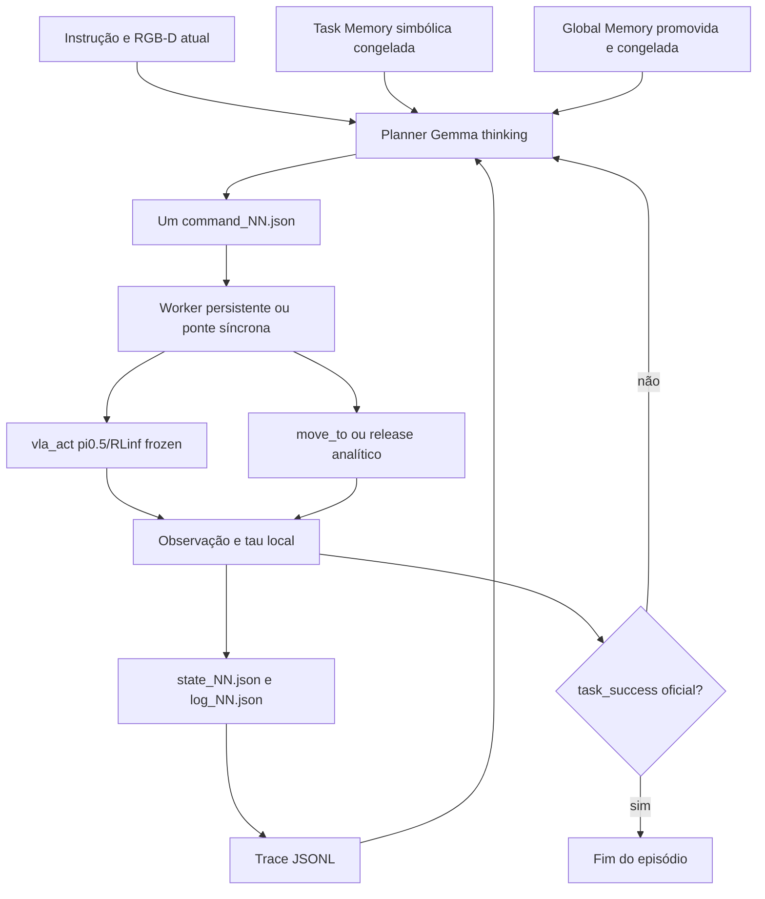

# Harness VLA: arquitetura funcional e avaliações

Atualizado em 2026-08-06. Fonte científica: **Harness VLA: Steering
Frozen VLAs into Reliable Manipulation Primitives via Memory-Guided Agents**,
arXiv:2607.08448v2.

Este relatório é a referência canônica para a arquitetura implementada, as
avaliações executadas e os limites das alegações. Os documentos em `docs/runs/`
são registros históricos e podem descrever versões anteriores.

## 1. Resumo executivo

O repositório implementa os componentes arquiteturais priorizados do Harness
VLA e os integra em testes simulador-free e em um lifecycle LIBERO físico. O
bootstrap promoveu Task/Global Memory; um deployment held-out carregou as duas
somente para leitura, concluiu a tarefa e preservou seus hashes. Isso valida o
lifecycle funcional mínimo. A reprodução arquitetural continua parcial quanto
à cobertura de benchmarks, e a reprodução experimental permanece pendente.

O checkpoint frozen é `RLinf/RLinf-Pi05-LIBERO-130-fullshot-SFT`; o planner é
`gemma4:12b` com thinking. O predicado oficial do ambiente continua sendo a
única fonte de `task_success`. Tau local, pós-condição da primitiva e ação aceita
são métricas distintas.

A evidência atual prova funcionamento arquitetural, não reprodução estatística
dos experimentos do paper. Não foram reproduzidos LIBERO-Pro, RoboCasa365,
RoboTwin C2R, todas as suites, todas as seeds ou as ablações publicadas.

## 2. Escopo científico

### 2.1 Paper-confirmed

- uma primitiva por turno;
- ciclo executar, observar, produzir feedback e replanejar;
- `vla_act(prompt, max_chunks, tau)` para fases de contato;
- primitivas analíticas para estrutura sem contato;
- Task Specific Memory simbólica;
- Global Memory incremental;
- separação entre bootstrap e deployment;
- percepção RGB-D/world map;
- REPL mediado por arquivos;
- término pelo predicado oficial da tarefa.

### 2.2 Paper-compatible

- execução estruturada de uma primitiva por objeto JSON;
- budgets e caps concretos necessários ao benchmark;
- execução eager na V100;
- transporte OSC nativo com `gripper=close`;
- projeção calibrada RGB-D;
- nomes de arquivos indexados na ponte REPL.

### 2.3 Beta-only

- thresholds e diagnósticos locais não especificados pelo paper;
- campos dos schemas JSON, hashes SHA-256, escrita atômica, idempotência e
  guards fail-closed;
- coordenadas visuais Gemma em grade normalizada `0..1000`;
- fórmula visual e lift mínimo de `0,03 m` do tau local;
- seleção de Gemma com thinking e o par reduzido bootstrap/deployment;
- probes em EB-Manipulation, EB-Navigation e OpenVLA fora do domínio;
- máscaras e contatos privilegiados das runs históricas;
- instrumentação oracle separada para medir erro;
- seleção reduzida de tarefas/seeds desta prova funcional.

## 3. Arquitetura implementada



### 3.1 Planner

`LiberoMultiTurnPlanner` recebe instrução, targets nominais, holding, último
feedback, budget e memória simbólica. Ele emite exatamente uma primitiva por
turno. O vocabulário LIBERO publicado está disponível:

```json
{"action":"vla_act","prompt":"...","target":"...","max_chunks":20,"tau":"lift_and_grasp"}
{"action":"move_to","target":"...","mode":"above|release_pose","gripper":"close"}
{"action":"move_pose","xyz":[0,0,0],"pose":[0,0,0,1],"gripper":"open|close"}
{"action":"rotate_wrist","target_yaw":0.0}
{"action":"rotate_pitch","target_pitch":0.0}
{"action":"set_gripper","gripper":"open|close"}
{"action":"release"}
```

Campos extras, targets desconhecidos, `xyz`, poses, coordenadas e múltiplas
primitivas falham fechado. O planner não recebe coordenadas oracle.

### 3.2 Worker e primitivas

- `vla_act`: usa observação viva, replaneja ações por chunks e devolve no
  primeiro tau elegível, sucesso oficial, término do ambiente ou budget;
- `vla_act(tau=task_success)`: normalização paper-compatible do predicado
  oficial LIBERO para placement restrito paper-confirmed, sem monitor de grasp;
- `move_to`: re-grounding visual do destino, projeção RGB-D e controle OSC
  fechado com garra fechada;
- `move_pose`, `rotate_wrist` e `rotate_pitch`: controle cartesiano/orientação
  por set-point validado no backend OSC;
- `set_gripper`: set-point estacionário de abertura ou fechamento;
- `release`: mantém pose e envia a convenção nativa de abertura `-1`;
- o worker recompila movimento analítico a partir da observação atual;
- o sucesso oficial interrompe imediatamente o episódio;
- nenhuma sequência universal grasp/transport/release é imposta pelo evaluator.

### 3.3 Percepção não privilegiada

O paper publica percepção RGB-D e world maps. O caminho LIBERO atual implementa
grounding RGB-D visual por frame e re-localização; não mantém ainda um world map
persistente completo entre turnos.

`OllamaVisualPixelLocator` envia apenas RGB e descrição textual ao
`gemma4:12b`. A resposta estrita contém pixel, confiança e bbox opcional em uma
robusta e projeta para mundo pela calibração da câmera.
grade normalizada. O adapter converte para coordenadas absolutas do frame,
seleciona profundidade robusta e projeta para mundo pela calibração da câmera.
robusta e projeta para mundo pela calibração da câmera.

A proveniência registra modelo, hash do prompt, câmera, frame, pixel, bbox,
confiança, profundidade e transformação de coordenadas. O caminho final não lê
segmentação, IDs de instância, pose do objeto ou bbox oracle. Durante transporte
a garra permanece fechada; oclusão na câmera externa não é interpretada como
perda de grasp. Contato privilegiado permanece apenas no caminho legado,
explicitamente classificado como beta-only.

### 3.4 Task Specific Memory

Uma run bootstrap completa e bem-sucedida pode gerar:

- `audit.json` com hashes e critérios de promoção;
- `commands.jsonl` com a estrutura ordenada das primitivas;
- bindings por label e papel, sem coordenadas;
- rejeição de trace incompleto, erro estrutural, pós-condição não verificada,
  contato ausente ou sucesso oficial falso.

No deployment, a estrutura é carregada somente para leitura. Toda geometria é
re-grounded na cena atual; `xyz`, poses e ações compiladas da seed são proibidos
na memória apresentada ao planner.

### 3.5 Global Memory

O ledger extrai candidatos com path, hash, turnos, primitiva e outcome. Resultado
booleano isolado fica `pending`; promoção exige interpretação semântica
explícita. Apenas regras promovidas são renderizadas no deployment. Reload
revalida a proveniência e rejeita decisão adulterada.

### 3.6 Bootstrap e deployment

`PhaseManifest` separa seeds e permissões:

- bootstrap: reset e escrita permitidos; métrica não reportável;
- deployment: reset e escrita proibidos; métrica reportável;
- budget efetivo é o mínimo entre configuração e política de fase;
- hashes de Task/Global Memory são capturados antes e comparados depois;
- uma tentativa de escrita ou reset falha antes de tocar o ambiente.

`set_init_state` materializa o initial state held-out do episódio; ele não
reseta nem reescreve memória.

### 3.7 REPL por arquivos

Cada teste usa pasta própria:

- `command_NN.json`: invocação do planner;
- `log_NN.json`: comando e resultado do worker;
- `state_NN.json`: marcador autoritativo de commit;
- `ledger.jsonl`: índice append-only;
- `status.json`: último turno concluído.

A beta implementa dois adapters sobre o mesmo protocolo: a ponte síncrona usada
no runner físico atual e um worker long-running separado, criado por factory e
proprietário do executor vivo. Testes com subprocesso confirmam dois comandos no
mesmo estado, replay sem duplicação, lock exclusivo e shutdown com `close()`.
Gaps, rewrite conflitante e arquivos malformados falham fechado. Uma queda
depois da ação física e antes do commit de `state_NN.json` continua sendo uma
janela não transacional do ambiente.

## 4. Runtime reproduzível

- hardware: 8 Tesla V100-SXM2-32GB, compute capability 7.0;
- GPU usada nas runs finais: índice físico 2;
- OpenPI commit: `15a9616a00943ada6c20a0f158e3adb39df2ccac`;
- checkpoint: `RLinf/RLinf-Pi05-LIBERO-130-fullshot-SFT`;
- revision: `6222623f635769bfc73c9472e29fab9b7fd8e027`;
- config: `pi05_libero`, bfloat16, action chunk nativo de 10 ações 7D;
- eager obrigatório: `TORCH_COMPILE_DISABLE=1` e
  `TORCHDYNAMO_DISABLE=1`;
- LIBERO offscreen: `MUJOCO_GL=egl`, `PYOPENGL_PLATFORM=egl`;
- planner/locator: Ollama `gemma4:12b`, com vision e thinking;
- planner thinking ativo; locator visual com `think=false` e output curto.

O health check final retornou 5 ações 7D finitas em `2,142 s`. O smoke visual
em frame LIBERO real localizou o bowl em `(72,675, 100,47)` no frame 256x256,
confiança `0,96`, com `privileged_segmentation=false`.

## 5. Avaliações históricas

Os denominadores abaixo não são agregados entre benchmarks ou entre
`task_success`, action success, tau e pós-condição.

### 5.1 EB-Manipulation

| Run/documento | Episódios | Task success | Evidência principal |
|---|---:|---:|---|
| Demo Qwen 2026-07-21 | 2 com trace | 0/2 | 25 subações aceitas; crash no terceiro episódio |
| Grounding/grasp 2026-07-21 | 3 probes | 0, 0, 1 | prova scripted isolada, não taxa de política |
| Gemma4 2026-07-27 | 3 | 1/3 | 67/67 ações aceitas; sucesso não prova grasp |
| RGB-D 2026-07-27 | 3 | 1/3 | 285 observações; `sim_mask` privilegiado |
| Pós-condições 2026-07-27 | 3 | 1/3 | 25/32 pós-condições; 60/60 ações aceitas |
| Trace incremental 2026-07-27 | 3 | 1/3 | 32 turnos reconstruídos |
| Gemma thinking A/C/D/E | 3 por etapa | 1/3 | parse 15, 10 e cerca de 6; pick-place final 3 turnos |

Conclusão: o planner e o loop funcionam em pick-place, mas stack/wipe ficaram
limitados pelo executor de contato scripted. Essas runs são probes beta e não
reprodução do benchmark publicado.

### 5.2 Task Memory e fases isoladas

- phase policy: fixture bootstrap `[0]`, deployment `[15,38]`, sem física;
- Task Memory offline: 0/3 traces promovidos corretamente;
- re-grounding sintético: 2 cenas resolvidas, uma rejeitada por objeto ausente;
- esses testes validaram guards, não ganho de performance.

### 5.3 OpenVLA CPU

Três episódios `[0,15,38]`, `task_success=0/3`, action success `79/90`, 14
pós-condições cumpridas e 19 falhas. Houve saturação translacional em `61/67`
chunks. O resultado é cross-domain e não demonstra uma causa única.

### 5.4 EB-Navigation

Gemma thinking resolveu 2/3 episódios, 41 passos de ambiente, 26 turnos e zero
parse errors. Valida a infraestrutura em outro embodiment, mas é beta-only e
não integra o protocolo do paper.

### 5.5 Baseline pi0.5/RLinf nativa

Duas attempts comparáveis em LIBERO-Spatial, dez tarefas e dois initial states:

| Attempt | Task success | Vídeos | Observação |
|---|---:|---:|---|
| `20260805_2345...20ep` | 19/20 | 11/20 | colisão de nomes preservada |
| `20260805_2359...videos_fixed` | 20/20 | 20/20 | baseline visual canônica |

As duas attempts são preservadas; a segunda não substitui a variação observada
na primeira.

### 5.6 Smokes LIBERO

| Run | Task success | Tau/local | Ações | Limite |
|---|---:|---:|---:|---|
| VLA-only | 1/1 | task tau | 78 | sem Harness |
| planner-facing `vla_act` | 1/1 | task tau | 80 | sem analíticas/memória |
| grounding RGB-D | não avaliado | 2/2 objetos | 0 | máscara privilegiada |
| lift/grasp eager | 0/1 | 1/1 | 53 | só fase de contato |
| lift/grasp canônico | 0/1 | 1/1 | 56 | só fase de contato |

A tentativa inicial de lift/grasp falhou antes de ações por Triton `sm_70`; os
artifacts incompletos foram preservados.

### 5.7 Multi-turn sem memórias

Task 0/state 0/seed 7, Gemma thinking e pi0.5/RLinf eager:

| Run | Task success | Turnos | Ações | Diagnóstico |
|---|---:|---:|---:|---|
| `_1` | incompleta | 0 | 0 | checkout LIBERO ausente no `PYTHONPATH` |
| `_2` | 0/1 | 8 | 95 | repetiu `move_to`; não emitiu release |
| `_3` | 1/1 | 7 | 123 | dois ciclos; segundo release concluiu |
| `_4` | 0/1 | 7 | 220 | grasp perdido e placement incompleto |
| `_5` | 1/1 | 8 | 177 | sucesso oficial no último `vla_act` |
| `_6` | 0/1 | 5 | 220 | release local completo, placement falso |

Runs comparáveis `_3` a `_6`: `2/4 task_success`. Todos têm `trace.jsonl` e
JSON válido; não houve parse/compile error. Cinco de seis releases localmente
completos não satisfizeram placement oficial, evidência direta de que sucesso
da primitiva não substitui sucesso da tarefa.

## 6. Lifecycle funcional final

O lifecycle foi fechado com bootstrap promovível, promoção explícita e
deployment held-out com hashes congelados. Tentativas incompletas são
preservadas em:

`evaluation_runs/libero_functional_protocol_20260806_190132/`

Critério de aceite:

- bootstrap seed 7 bem-sucedida e não reportável;
- Task Memory promovida sem coordenadas;
- Global Memory promovida com interpretação semântica explícita;
- deployment seed 101/initial state 1, sem reset ou escrita de memória;
- grounding visual novo, REPL válido e memórias congeladas;
- ao menos uma primitiva VLA e uma analítica observadas no lifecycle;
- `task_success=true` oficial antes do budget;
- hashes antes/depois idênticos.

### 6.1 Bootstrap físico preservado e rejeitado

`bootstrap_task0_state0_seed7_commit_7aff1a9` terminou com
`task_success=false`, `horizon_exhausted`, 6 turnos e 220 ações. Grasp, transporte
e release reportaram pós-condições locais verdadeiras em 58, 28 e 10 ações, mas
o placement oficial permaneceu falso. As três recuperações seguintes falharam.
Logo, a run não pode gerar Task Memory: além de sucesso oficial falso, contém
primitivas sem pós-condição verificada.

`bootstrap_task0_state0_seed7_commit_a24dd3e` removeu o probe inicial: o grasp
foi verificado em 70 ações e dois ciclos grasp/transporte/release tiveram
pós-condições locais verdadeiras, mas ambos os releases deixaram
`task_success=false`. A run terminou após 8 turnos/176 ações; o último transporte
esgotou seu budget. Ela também foi rejeitada para promoção.

O diagnóstico causal atual é falsificável: `move_to` valida o erro do
end-effector, enquanto `On(bowl, plate)` exige contato e distância XY entre
centros menor que `0,03 m`. O offset de grasp EEF-objeto pode manter a primeira
pós-condição verdadeira e violar a segunda. Uma instrumentação privilegiada
**beta-only**, isolada do planner e da ação, foi adicionada para medir essa
geometria em uma única run diagnóstica.

`diagnostic_task0_state0_seed7_commit_721fc6d` terminou com sucesso oficial em
2 turnos e 94 ações, mas não testou essa hipótese: após um probe VLA de 5 ações
sem pós-condição, a segunda chamada `vla_act` completou toda a tarefa em 89
ações. O resultado confirma que `task_success` oficial deve encerrar a run mesmo
com tau visual falso; não fornece snapshots de transporte e não é promovível.

### 6.2 Bootstrap promovido e memórias congeladas

`bootstrap_task0_state0_seed7_commit_024d6b7` terminou com
`task_success=true`, `termination_reason=task_success`, 1 turno e 79 ações. A
única invocação foi `vla_act(max_chunks=20, tau=lift_and_grasp)`. O tau visual
permaneceu falso, mas todas as pós-condições executadas foram verificadas e o
predicado oficial encerrou o episódio. A run é visual-only, não reportável e
não usou segmentação ou contato privilegiado.

O lifecycle estrito aceitou a Task Memory sem relaxar gates. O conteúdo
persistido é simbólico: uma chamada `vla_act` e o label/role do alvo, sem pose
ou coordenadas. A Global Memory produziu um candidato `success_rule`, promovido
explicitamente com a interpretação limitada pela evidência: sucesso oficial da
tarefa é terminação autoritativa mesmo quando o tau visual local permanece
falso.

O primeiro preparo de deployment revelou que o ledger preservava o
`trace_path` relativo ao CWD do bootstrap. O carregamento a partir de
`EmbodiedBench` falhou antes de criar o ambiente ou executar ações. A correção
resolve caminhos de proveniência antes de persistir o ledger e tem teste que
muda o CWD entre bootstrap e deployment. Os artifacts anteriores foram
preservados; um conjunto canônico foi gerado em
`task_memory_commit_024d6b7_canonical` e
`global_memory_commit_024d6b7_canonical.json`.

Hashes congelados antes do deployment held-out:

- Task Memory audit: `9cb5f2c8abe40c331cae20f3a7bd0494c9024cd2ed2077b90ed935b383610b85`;
- Task Memory commands: `3c3310d3f063dcc0a749604b9190be6cda47bdb889c367f26c0cccb676019f3a`;
- Global Memory ledger: `64dbc728153755694e17de1a2197e209fd7f5230126f6ef7e5f3f53e727f4baf`;
- Global Memory renderizada: `3e555b0ab4fbadbb2d36d14432f95c476f61eafdc77843b67e15ef3332403d45`.

Isto valida o lifecycle de promoção, mas não demonstra composição entre VLA e
primitivas analíticas: nesse bootstrap, uma única chamada VLA concluiu a tarefa.

### 6.3 Deployment held-out

`deployment_task0_state1_seed101_commit_024d6b7_canonical` executou a initial
state 1, diferente do bootstrap, com seed held-out 101. O runner carregou Task e
Global Memory somente para leitura, fez grounding visual novo e não habilitou
diagnósticos privilegiados. A run terminou com `status=completed`,
`task_success=true`, `termination_reason=task_success`, `reportable=true` e
`harness_complete=true`.

Foram 1 turno e 85 ações. A invocação foi
`vla_act(max_chunks=20, tau=lift_and_grasp)`; novamente o tau visual ficou falso
e o predicado oficial verdadeiro encerrou a tarefa. A verificação posterior
persistida em `memory_integrity.json` comparou Task Memory audit/commands e
Global Memory ledger/renderização: todos os hashes antes/depois são idênticos,
com `unchanged=true`.

Assim, o lifecycle funcional mínimo está validado. O critério exploratório de
observar uma primitiva VLA e uma analítica no mesmo lifecycle não foi atingido:
o VLA frozen concluiu ambos os episódios em uma única invocação. Isso limita a
evidência de composição, mas não invalida os contratos de fase, memória,
protocolo, terminação oficial e isolamento perceptual exercitados.

## 7. Validação de software

Evolução do conjunto completo:

- antes da integração final: `339 passed`;
- memória/REPL/percepção/integração focados: `99 passed`;
- após integração: `374 passed`;
- após contrato visual normalizado: `375 passed`;
- após compatibilidade Python 3.8 e semântica oficial: `375 passed`;
- após transporte não privilegiado resistente a oclusão: `376 passed`.
- após vocabulário LIBERO, worker persistente e diagnósticos isolados:
  `406 passed`;
- após lifecycle físico, deployment held-out e regressão de proveniência:
  `413 passed`.

`git diff --check` e diagnósticos do editor passaram nos arquivos alterados.

Commits da arquitetura funcional:

| Commit | Unidade lógica |
|---|---|
| `ab144b0` | lifecycle de memórias |
| `a16cbd2` | REPL idempotente |
| `97e10de` | grounding visual RGB-D |
| `a756b04` | fases e integração funcional |
| `e588f92` | coordenadas visuais normalizadas |
| `c7641c4` | Python 3.8 e sucesso oficial da primitiva |
| `0802a8a` | proveniência do manifest |
| `7aff1a9` | transporte sem falso grasp loss por oclusão |
| `6320286` | vocabulário LIBERO e worker REPL persistente |
| `721fc6d` | diagnóstico de placement isolado da política |
| `a24dd3e` | budget de contato limitado por tau, sem probe inicial |
| `024d6b7` | placement VLA com predicado oficial LIBERO |

## 8. Falhas classificadas

1. formato LLM: truncamento nas etapas Gemma antigas; resolvido no caminho
   multi-turn atual;
2. contrato de primitiva: repetição de `move_to` corrigida por feedback
   semântico;
3. grounding: caminho histórico privilegiado substituído por locator visual;
4. percepção: coordenadas Gemma inicialmente fora do frame; contrato 0..1000
   explicitado e testado;
5. planejamento: release/recuperação permanecem escolhas do planner;
6. física: placement variável e grasp perdido nas runs históricas;
7. infraestrutura: Triton V100, `PYTHONPATH` LIBERO e Python 3.8 no REPL foram
   corrigidos, preservando artifacts incompletos;
8. instrumentação: sucesso oficial com tau visual falso revelou a necessidade
   de manter os dois campos separados.

## 9. Riscos e não alegações

- N=1 no lifecycle final prova composição, não robustez;
- placement físico continua variável;
- o locator visual pode falhar por ambiguidade ou oclusão e deve falhar
  explicitamente ao resolver um novo alvo;
- exatamente-uma-vez não é garantido se o processo cair após a ação física e
  antes do commit do estado;
- o runner físico ainda usa a ponte síncrona; o worker persistente separado foi
  validado por subprocesso, não por rollout LIBERO;
- não há comparação pareada com memórias on/off em seeds suficientes;
- não há resultados comparáveis a LIBERO-Pro, RoboCasa365 ou RoboTwin C2R;
- nenhuma melhoria estatística sobre a baseline frozen é alegada.

## 10. Próximos passos experimentais

1. repetir o deployment em seeds held-out fixas sem alterar código;
2. executar ablações task-only, global-only e ambas;
3. parear Harness e VLA direta no mesmo checkpoint/seeds/budgets;
4. ampliar para dez tarefas e depois quatro suites LIBERO;
5. somente então executar LIBERO-Pro e os demais embodiments publicados.
